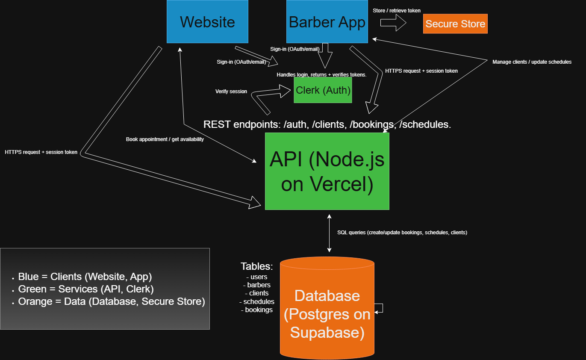

<!-- Logo / Banner -->
<p align="center">
  
</p>

<h1 align="center">BarberApp</h1>
<p align="center">Scheduling and client management for barbers. Expo app for barbers. Optional front-desk tablet view. GIF demos included.</p>

<p align="center">
  <a href="https://shields.io">
    
  </a>
  
  
  
</p>

---

## Table of Contents
- [Overview](#overview)
- [Demos](#demos)
- [Quickstart](#quickstart)
- [Configuration](#configuration)
- [Features](#features)
- [Architecture](#architecture)
- [Usage Examples](#usage-examples)
- [Dependencies](#dependencies)
- [FAQ](#faq)
- [Contributing](#contributing)
- [Acknowledgements](#acknowledgements)
- [License](#license)

---

## Overview
BarberApp provides:
- **Expo mobile app** for barbers to manage schedules, clients, and profile.
- **Front-desk tablet** flow with PIN gate.
- **Mock data** out of the box. Optional Supabase storage for images. Clerk auth screens included.

All UI is in this repo under `app/`. State is mocked in `libs/` with optional Supabase calls.

---

## Demos
Developer Quickstart (GIF):  


User Booking/Profile (GIF):  


Accessibility note: Both GIFs include concise alt text above.

---

## Quickstart
> Requirements: Node 18+, npm, Expo CLI (`npm i -g expo`), a Clerk publishable key, a Supabase project (optional for media uploads).

1) Clone
```bash
git clone https://github.com/<your-username>/<repo-name>.git
cd <repo-name>
```

2) Configure environment variables (create `.env` in repo root)
```bash
# Auth (Clerk)
EXPO_PUBLIC_CLERK_PUBLISHABLE_KEY=your_clerk_pk

# Supabase (optional but required for image upload)
EXPO_PUBLIC_SUPABASE_URL=your_supabase_url
EXPO_PUBLIC_SUPABASE_ANON_KEY=your_supabase_anon_key
```

3) Install and run
```bash
npm install
npm run web     # or: npm start  (choose web / iOS / Android in Expo)
```

4) Open the app
```bash
# If not auto-opened:
http://localhost:8081        # Expo dev UI
http://localhost:19006       # Web app preview (Expo Web)
```

> iOS/Android: Use the Expo Go app or run `npm run ios` / `npm run android` if configured.

---

## Configuration
**Clerk**  
Set `EXPO_PUBLIC_CLERK_PUBLISHABLE_KEY`. The app uses Clerk screens in `app/(auth)` and protects routes in `app/(protected)`.

**Supabase**  
Set `EXPO_PUBLIC_SUPABASE_URL` and `EXPO_PUBLIC_SUPABASE_ANON_KEY` if you want to upload images from the app Profile screen. See `libs/supabase.ts` and `libs/storage.ts`.

**Deep link scheme**  
Configured as `legendsapp` in `app.json`.

---

## Features
- **Schedule management**: View day schedule, add appointments, detect overlaps, cancel or retime.
- **Requests inbox**: Accept or reject incoming requests with conflict checks.
- **Clients**: Filterable list and per-client private notes.
- **Profile**: Display name, bio, avatar upload, specialties, before/after gallery, social links.
- **Front-desk tablet**: PIN gate and day view for reception workflows.
- **Auth**: Clerk email/password and Google SSO.
- **Storage**: Optional Supabase Storage for images (avatar, before/after).

---

## Architecture


**Components**
- **App UI**: Expo Router screens in `app/`
- **Auth**: Clerk provider in `app/_layout.tsx`
- **Data layer**: Mock data in `libs/mock.ts` and in-memory session in `libs/session.ts`
- **Optional persistence**: Supabase client in `libs/supabase.ts`, uploads in `libs/storage.ts`, profile table helpers in `libs/db.ts`

---

## Usage Examples

**Navigate auth → tabs (Clerk protected)**
```tsx
// app/(protected)/_layout.tsx
import { Stack, Redirect } from "expo-router"
import { useAuth } from "@clerk/clerk-expo"

export default function ProtectedLayout() {
  const { isSignedIn, isLoaded } = useAuth()
  if (!isLoaded) return null
  if (!isSignedIn) return <Redirect href="/(auth)/sign-in" />
  return <Stack screenOptions={{ headerShown: false }} />
}
```

**Add an appointment with overlap check**
```tsx
// simplified from app/(protected)/barber/(tabs)/schedule.tsx
const conflicts = existing.filter(a => {
  const aStart = toMin(a.start_time)
  const aEnd = aStart + totalDurationMin(a.service_names)
  return newStart < aEnd && aStart < newEnd
})
if (conflicts.length) {
  Alert.alert("Possible overlap", "Proceed?", [
    { text: "Cancel" },
    { text: "Book anyway", onPress: () => onSubmit(payload) },
  ])
} else {
  onSubmit(payload)
}
```

**Upload image to Supabase Storage**
```ts
// libs/storage.ts
export async function uploadImageFromUri(uri?: string, folder?: string, name?: string) {
  if (!uri || !folder) return undefined
  if (/^https?:\/\//i.test(uri)) return uri
  // read local file, upload bytes to Supabase, return public URL
}
```

**Show toast feedback**
```tsx
// app/providers/ToastProvider.tsx
const { showToast } = useToast()
showToast({ type: "success", title: "Profile saved" })
```

---

## Dependencies
- **expo** `~53.x`, **react-native** `0.79.x`, **expo-router** `^5.x`
- **@clerk/clerk-expo** for auth
- **@supabase/supabase-js** for optional data/storage
- **expo-image-picker**, **expo-secure-store**, **expo-web-browser**
- **lucide-react-native** for icons

Full list in `package.json`.

---

## FAQ

**Does this require a backend?**  
No for basic demo. Mock data works out of the box. Supabase enables image uploads and logging.

**Do I need Clerk to run it?**  
Yes for protected routes. You can comment auth gates for a demo, but the assignment expects working auth or a clear mock.

**How do I run web vs native?**  
Use `npm run web` for web. Use Expo Go or `npm run ios` / `npm run android` for native.

**How do I add a new service or barber?**  
Edit `libs/mock.ts` arrays `SERVICES` and `BARBERS`.

---

## Contributing
- Fork and create a feature branch.
- Run the app locally and ensure Expo builds for web and native.
- Submit a pull request with description and screenshots/GIFs.
- Follow conventional commits for clarity.

---

## Acknowledgements
- Clerk for auth flows.  
- Supabase for storage and Postgres integration.  
- Expo team for managed RN tooling.  
- [Lucide](https://lucide.dev) icons.  

---

## License
MIT
