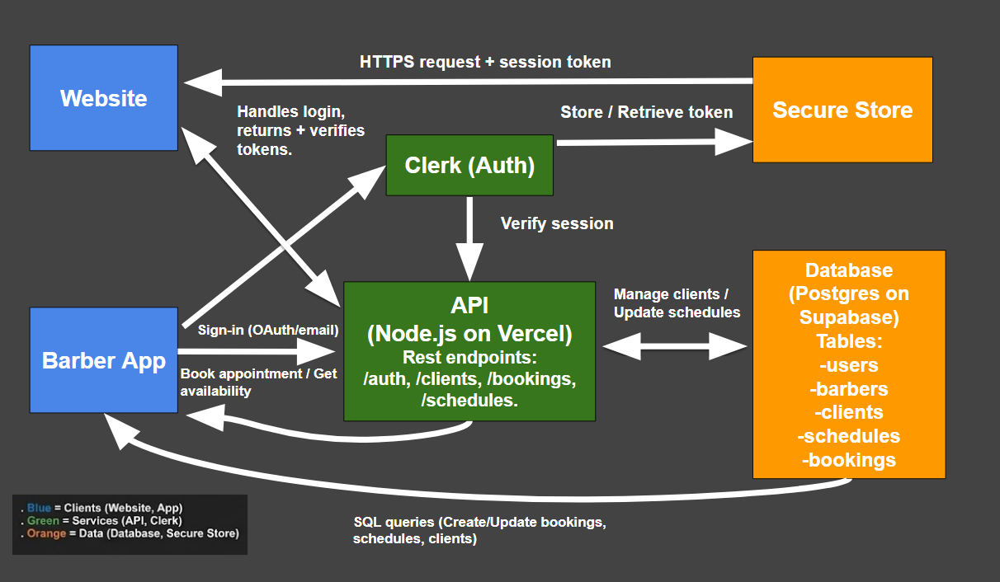
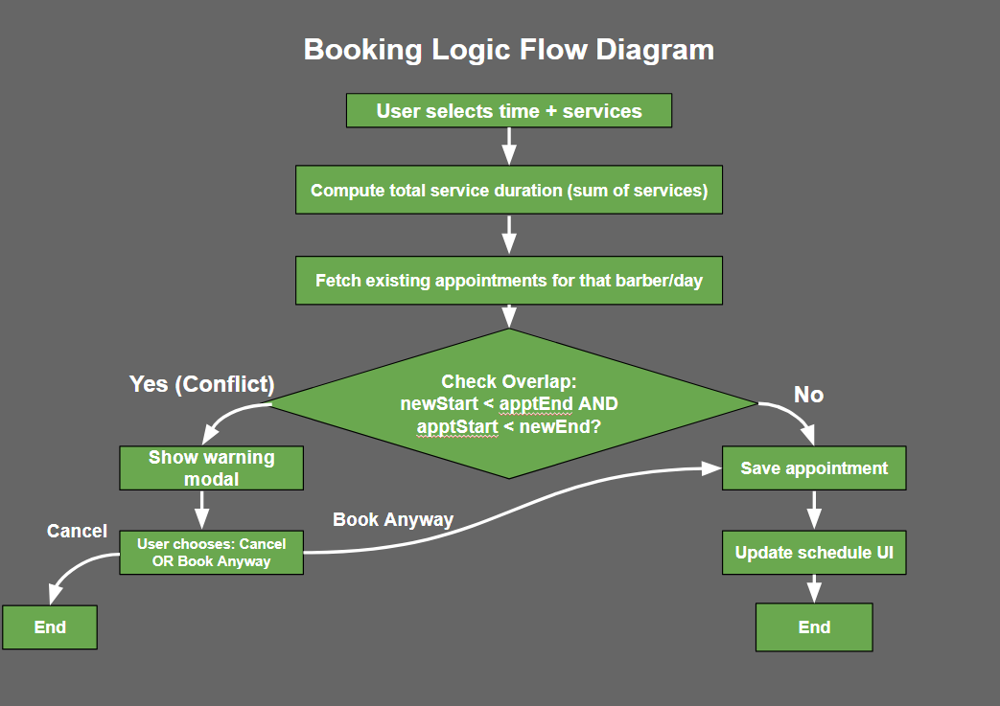

  

<h1 align="center">BarberApp</h1>

Scheduling and client management for barbers.   An Expo app for barbers with an optional front-desk tablet flow.

---

## Table of Contents
- [Overview](#overview)
- [Quickstart](#quickstart)
- [Demos](#demos)
- [Configuration](#configuration)
- [Features](#features)
- [Architecture & Logic](#architecture--logic)
- [Usage Examples](#usage-examples)
- [Dependencies](#dependencies)
- [FAQ](#faq)
- [License & Contribution](#license--contribution)

---

## Overview
BarberApp includes:
- **Barber Interface:** Expo mobile app for barbers to manage schedules, clients, and profile.
- **Shop Interface:** Front-desk tablet flow with PIN.
- **Data:** Mock data out of the box. Optional Supabase storage for images. Clerk auth screens included.

UI lives in `app/`. Mock data and helpers are in `libs/`.

---

## Quickstart
> **Requirements:** Node 18+, npm, Expo CLI (`npm i -g expo`), a Clerk publishable key, optional Supabase project for image uploads.

    # 1. Clone the repository
    git clone https://github.com/<your-username>/<repo-name>.git
    cd <repo-name>

    # 2. Configure environment variables (create .env in repo root)
    EXPO_PUBLIC_CLERK_PUBLISHABLE_KEY=your_clerk_pk
    EXPO_PUBLIC_SUPABASE_URL=your_supabase_url
    EXPO_PUBLIC_SUPABASE_ANON_KEY=your_supabase_anon_key

    # 3. Install dependencies
    npm install

    # 4. Run the app
    npm run web
    # If not auto-opened:
    # http://localhost:19006

---

## Demos

**User App Demo**  
Shows a barber editing availability, updating profile details, and seeing changes reflected in the schedule and profile screens.

  

---

## Configuration

**Clerk**  
Set `EXPO_PUBLIC_CLERK_PUBLISHABLE_KEY`. Auth screens are in `app/(auth)`. Protected routes are in `app/(protected)`.

**Supabase**  
Set `EXPO_PUBLIC_SUPABASE_URL` and `EXPO_PUBLIC_SUPABASE_ANON_KEY` to enable image uploads in the Profile screen. See `libs/supabase.ts` and `libs/storage.ts`.

**Deep link scheme**  
Configured as `legendsapp` in `app.json`.

---

## Features
- **Schedule:** view day, add appointments, detect overlaps, cancel or retime.
- **Requests:** accept or reject incoming requests with conflict checks.
- **Clients:** searchable list with per-client private notes.
- **Profile:** display name, bio, avatar, specialties, before/after gallery, social links.
- **Front-desk tablet:** PIN gate and day view.
- **Auth:** Clerk email/password and Google SSO.
- **Storage:** optional Supabase Storage for images.

---

## Architecture & Logic

### 1. System Architecture

**Components**
- **App UI**
  - Expo Router screens in `app/`
  - Stacked layouts for `(auth)` vs `(protected)` routes
- **Auth**
  - Clerk provider in `app/_layout.tsx`
  - Session-aware guards in `app/(protected)/_layout.tsx`
- **Data layer**
  - Mock data in `libs/mock.ts`
  - Session helpers in `libs/session.ts`
- **Optional persistence**
  - Supabase client in `libs/supabase.ts`
  - Upload helpers in `libs/storage.ts`
  - Profile helpers in `libs/db.ts` (e.g., storing profile and gallery metadata)

The default path uses only the mock data layer so the app runs without any backend configured. Supabase can be enabled later for storing images and logs without changing the UI layer.

### 2. Booking Logic Flow

- **Conflict Detection:**  
  For each new appointment, the app calculates `start_time + service_duration` and compares against existing appointments. If any time ranges overlap, the barber is warned before double-booking.

---

## Usage Examples

**Protect routes with Clerk**

    // app/(protected)/_layout.tsx
    import { Stack, Redirect } from "expo-router"
    import { useAuth } from "@clerk/clerk-expo"

    export default function ProtectedLayout() {
      const { isSignedIn, isLoaded } = useAuth()
      if (!isLoaded) return null
      if (!isSignedIn) return <Redirect href="/(auth)/sign-in" />
      return <Stack screenOptions={{ headerShown: false }} />
    }

**Add appointment with overlap check**

    // simplified from schedule screen
    const conflicts = existing.filter(a => {
      const aStart = toMin(a.start_time)
      const aEnd = aStart + totalDurationMin(a.service_names)
      return newStart < aEnd && aStart < newEnd
    })
    if (conflicts.length) {
      Alert.alert("Possible overlap", "Proceed?", [
        { text: "Cancel" },
        { text: "Book anyway", onPress: () => onSubmit(payload) },
      ])
    } else {
      onSubmit(payload)
    }

**Upload image to Supabase Storage**

    // libs/storage.ts (excerpt)
    export async function uploadImageFromUri(uri?: string, folder?: string, name?: string) {
      if (!uri || !folder) return undefined
      if (/^https?:\/\//i.test(uri)) return uri
      // read local file, upload bytes, return public URL
    }

**Toast feedback**

    // app/providers/ToastProvider.tsx (usage)
    const { showToast } = useToast()
    showToast({ type: "success", title: "Profile saved" })

---

## Dependencies
- expo `~53.x`
- react-native `0.79.x`
- expo-router `^5.x`
- @clerk/clerk-expo
- @supabase/supabase-js
- expo-image-picker
- expo-secure-store
- expo-web-browser
- lucide-react-native

Full list in `package.json`.

---

## FAQ

**Does this require a backend?**  
No for a demo. Mock data works out of the box. Supabase enables image uploads and logging.

**Do I need Clerk to run it?**  
Yes for protected routes. You can relax guards in `(protected)` layouts for a mock demo if needed.

**How do I run web vs native?**  
Use `npm run web` for web. Use Expo Go or `npm run ios` / `npm run android` for native.

**How do I add a service or barber?**  
Edit `SERVICES` and `BARBERS` in `libs/mock.ts`.

---
