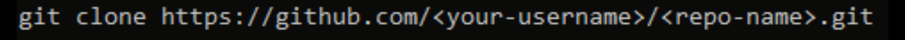

<p align="center">
  
</p>

<h1 align="center">BarberApp</h1>
<p align="center">Scheduling and client management for barbers. Expo app for barbers with an optional front-desk tablet flow.</p>

---

## Table of Contents
- [Overview](#overview)
- [Demos](#demos)
- [Quickstart](#quickstart)
- [Configuration](#configuration)
- [Features](#features)
- [Architecture](#architecture)
- [Usage Examples](#usage-examples)
- [Dependencies](#dependencies)
- [FAQ](#faq)

---

## Overview
BarberApp includes:
- Expo mobile app for barbers to manage schedules, clients, and profile.
- Front-desk tablet flow with PIN.
- Mock data out of the box. Optional Supabase storage for images. Clerk auth screens included.

UI lives in `app/`. Mock data and helpers are in `libs/`.

---

## Demos
Developer Quickstart  


User App Demo  


---

## Quickstart
> Requirements: Node 18+, npm, Expo CLI (`npm i -g expo`), a Clerk publishable key, optional Supabase project for image uploads.

1) Clone
```bash
git clone https://github.com/<your-username>/<repo-name>.git
cd <repo-name>
```

2) Configure environment variables (create `.env` in repo root)
```bash
EXPO_PUBLIC_CLERK_PUBLISHABLE_KEY=your_clerk_pk
EXPO_PUBLIC_SUPABASE_URL=your_supabase_url
EXPO_PUBLIC_SUPABASE_ANON_KEY=your_supabase_anon_key
```

3) Install and run
```bash
npm install
npm run web
```

4) Open the app
```bash
# If not auto-opened:
http://localhost:19006
```

---

## Configuration
**Clerk**  
Set `EXPO_PUBLIC_CLERK_PUBLISHABLE_KEY`. Auth screens are in `app/(auth)`. Protected routes are in `app/(protected)`.

**Supabase**  
Set `EXPO_PUBLIC_SUPABASE_URL` and `EXPO_PUBLIC_SUPABASE_ANON_KEY` to enable image uploads in the Profile screen. See `libs/supabase.ts` and `libs/storage.ts`.

**Deep link scheme**  
Configured as `legendsapp` in `app.json`.

---

## Features
- Schedule: view day, add appointments, detect overlaps, cancel or retime.
- Requests: accept or reject incoming requests with conflict checks.
- Clients: searchable list with per-client private notes.
- Profile: display name, bio, avatar, specialties, before/after gallery, social links.
- Front-desk tablet: PIN gate and day view.
- Auth: Clerk email/password and Google SSO.
- Storage: optional Supabase Storage for images.

---

## Architecture


**Components**
- App UI: Expo Router screens in `app/`
- Auth: Clerk provider in `app/_layout.tsx`
- Data layer: mock data in `libs/mock.ts`, session helpers in `libs/session.ts`
- Optional persistence: Supabase client in `libs/supabase.ts`, uploads in `libs/storage.ts`, profile helpers in `libs/db.ts`

---

## Usage Examples

**Protect routes with Clerk**
```tsx
// app/(protected)/_layout.tsx
import { Stack, Redirect } from "expo-router"
import { useAuth } from "@clerk/clerk-expo"

export default function ProtectedLayout() {
  const { isSignedIn, isLoaded } = useAuth()
  if (!isLoaded) return null
  if (!isSignedIn) return <Redirect href="/(auth)/sign-in" />
  return <Stack screenOptions={{ headerShown: false }} />
}
```

**Add appointment with overlap check**
```tsx
// simplified from schedule screen
const conflicts = existing.filter(a => {
  const aStart = toMin(a.start_time)
  const aEnd = aStart + totalDurationMin(a.service_names)
  return newStart < aEnd && aStart < newEnd
})
if (conflicts.length) {
  Alert.alert("Possible overlap", "Proceed?", [
    { text: "Cancel" },
    { text: "Book anyway", onPress: () => onSubmit(payload) },
  ])
} else {
  onSubmit(payload)
}
```

**Upload image to Supabase Storage**
```ts
// libs/storage.ts (excerpt)
export async function uploadImageFromUri(uri?: string, folder?: string, name?: string) {
  if (!uri || !folder) return undefined
  if (/^https?:\/\//i.test(uri)) return uri
  // read local file, upload bytes, return public URL
}
```

**Toast feedback**
```tsx
// app/providers/ToastProvider.tsx (usage)
const { showToast } = useToast()
showToast({ type: "success", title: "Profile saved" })
```

---

## Dependencies
- expo `~53.x`, react-native `0.79.x`, expo-router `^5.x`
- @clerk/clerk-expo
- @supabase/supabase-js
- expo-image-picker, expo-secure-store, expo-web-browser
- lucide-react-native

Full list in `package.json`.

---

## FAQ

**Does this require a backend?**  
No for a demo. Mock data works out of the box. Supabase enables image uploads and logging.

**Do I need Clerk to run it?**  
Yes for protected routes. You can relax guards for a mock demo if needed.

**How do I run web vs native?**  
Use `npm run web` for web. Use Expo Go or `npm run ios` / `npm run android` for native.

**How do I add a service or barber?**  
Edit `SERVICES` and `BARBERS` in `libs/mock.ts`.
